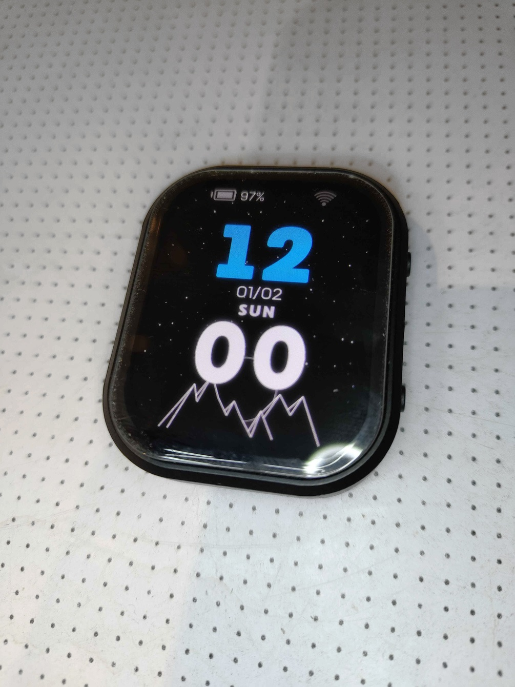
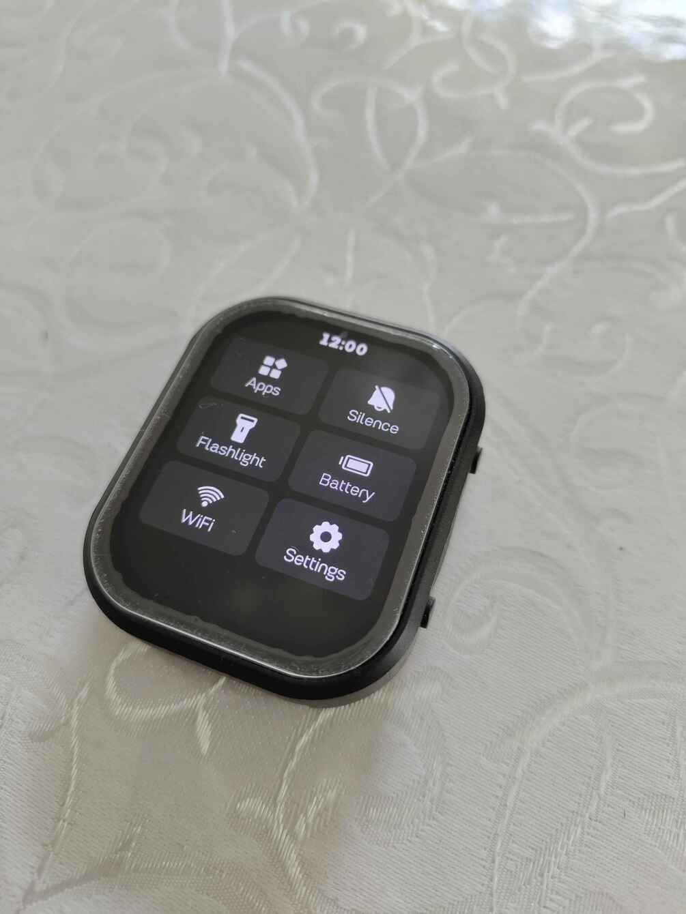
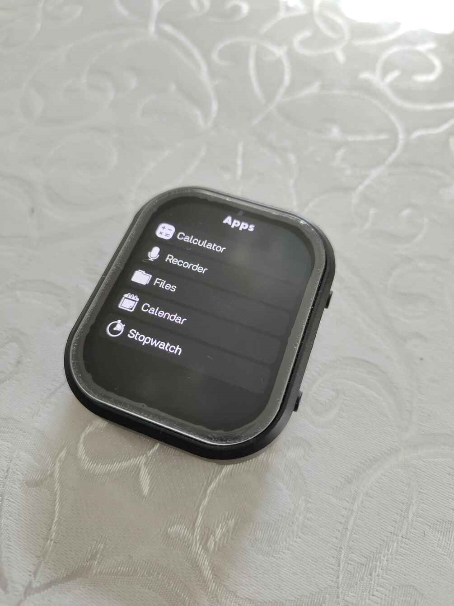
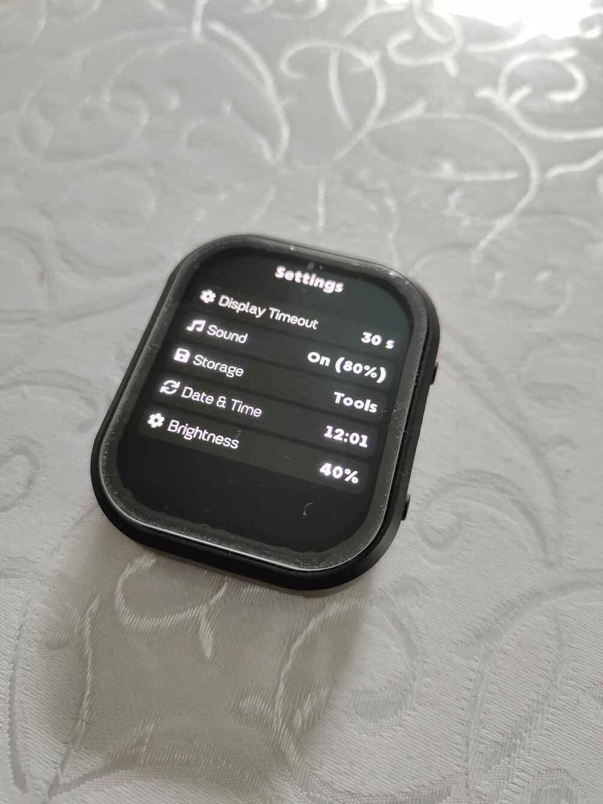
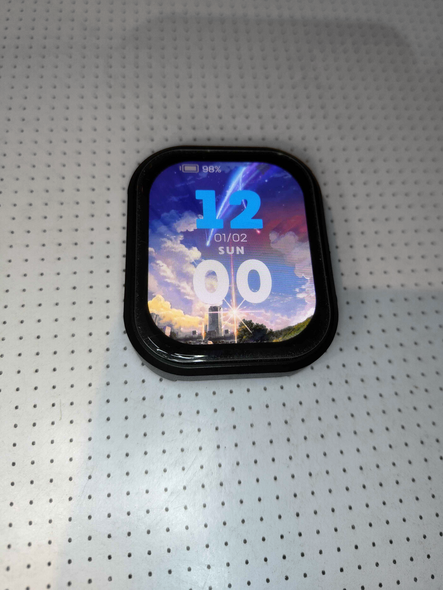

# ESP32-S3 Touch AMOLED Watch Firmware

Custom firmware for the **Waveshare ESP32-S3-Touch-AMOLED-2.06** smartwatch development board.

This project provides a ready-to-flash firmware build with additional features and customization options for the watch.
## Screenshots

### Main interface

### Watch menu

### Applications

### Settings

### Wi-Fi

### Custom wallpaper

## ✨ Features

- Custom smartwatch interface
- Touchscreen support
- AMOLED display support
- Wi-Fi functionality
- Custom wallpapers
- Wallpaper conversion tool
- Additional watch customization
- Optimized firmware for the Waveshare ESP32-S3-Touch-AMOLED-2.06

> More detailed information about the available features and firmware behavior can be found in the documentation.

## 📱 Supported device

**Waveshare ESP32-S3-Touch-AMOLED-2.06**

The firmware is intended specifically for this board.

## 📥 Download

The firmware is completely **free**.

Download the latest release from the GitHub Releases page:

**[Download the latest firmware](../../releases/latest)**

The firmware file is:

S3Watch_flash.bin
You do not need the source code to install or use the firmware.

## 🔧 Installation

The firmware can be installed using Espressif Flash Download Tool.

See the complete installation guide:

## 📖 Flashing instructions

The current firmware uses:

- Chip: ESP32-S3
- Work mode: Develop
- Firmware address: 0x0
- SPI Mode: DIO
- SPI Speed: 40MHz
- Baud rate: 115200 or 460800
## 🖼️ Custom wallpapers

The firmware supports custom wallpapers.

You can prepare wallpapers using the included conversion tool:

convert_wallpaper.py

Detailed instructions:

## 🖼️ Wallpaper guide

## 📶 Wi-Fi configuration

Wi-Fi can be configured using the procedure described in the documentation.

## 📶 Wi-Fi setup guide

## 📚 Documentation
Guide	Description
Flashing	Install the firmware using Flash Download Tool
Wallpapers	Create and install custom wallpapers
Wi-Fi	Configure Wi-Fi
Changelog	Firmware release history

## 💾 Firmware
File	Description
S3Watch_flash.bin	Compiled firmware for ESP32-S3-Touch-AMOLED-2.06
## ⚠️ Important

This firmware is intended for the Waveshare ESP32-S3-Touch-AMOLED-2.06 board.

Do not flash it to a different device unless compatibility has been confirmed.

Flashing custom firmware can erase existing data or change the behavior of the device. Follow the installation instructions carefully.

## ❤️ Support the project

The firmware is free to download and use.

## 📄 License

License information will be added later.

## 📋 Changelog

See the CHANGELOG.md file for release history.
